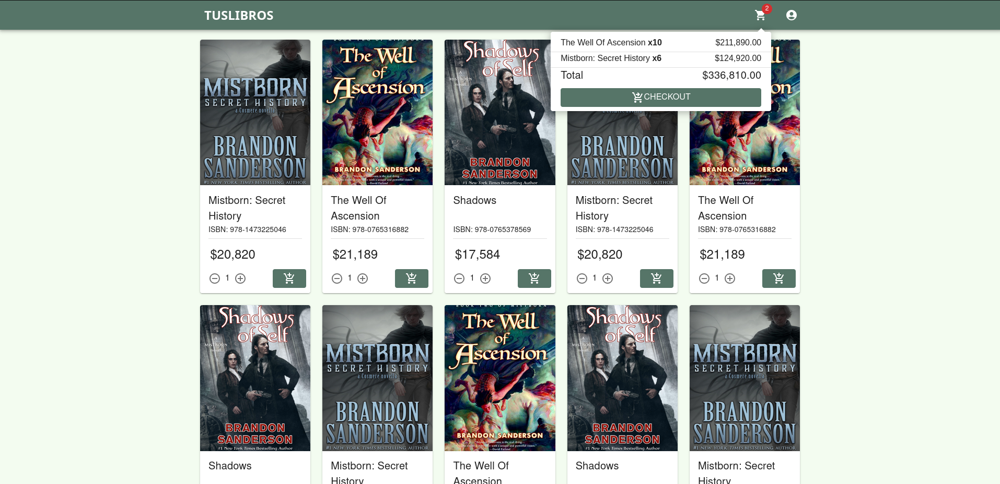

# TusLibros

Sistema de compras online para la editorial ficticia "TusLibros". Hecho con Go mediante TDD usando la biblioteca "Testify". Originalmente era un trabajo de la materia Ingenieria de Software I, mediante TDD en SmallTalk.



## Sources

- Materia: [Ingeniería de Software I, Facultad de Ciencias Exactas y Naturales, Universidad de Buenos Aires](https://www.isw2.com.ar/)
- Profesor: [Hernán Wilkinson](https://x.com/HernanWilkinson)

## Structure


## Requirements


```
TusLibros
├─ README.md
├─ assets
│  ├─ Architecture.png
│  ├─ ArchitectureTLDRAW.tldr
│  ├─ Demo.png
│  ├─ EjercicioTusLibros.pdf
│  ├─ Enunciado1.jpg
│  └─ Enunciado2.jpg
├─ cmd
│  └─ tus-libros
│     ├─ enablecors.go
│     ├─ localdata.go
│     └─ main.go
├─ go.mod
├─ go.sum
├─ internal
│  ├─ api
│  │  ├─ handlers.go
│  │  └─ handlers_test.go
│  ├─ book
│  │  └─ book.go
│  ├─ cart
│  │  ├─ cart.go
│  │  ├─ cartErrorMessages.go
│  │  └─ cart_test.go
│  ├─ cartSession
│  │  └─ cartSession.go
│  ├─ cashier
│  │  ├─ cashier.go
│  │  ├─ cashierErrorMessages.go
│  │  └─ cashier_test.go
│  ├─ clock
│  │  ├─ clock.go
│  │  ├─ localClock.go
│  │  └─ mockClock.go
│  ├─ creditCard
│  │  └─ creditCard.go
│  ├─ lineItem
│  │  └─ lineItem.go
│  ├─ merchantProcessor
│  │  ├─ localMerchantProcessor.go
│  │  ├─ merchantProcessor.go
│  │  ├─ merchantProcessorErrorMessages.go
│  │  └─ mockMerchantProcessor.go
│  ├─ sale
│  │  └─ sale.go
│  ├─ salesBook
│  │  └─ salesBook.go
│  ├─ testsObjectFactory
│  │  └─ testsObjectFactory.go
│  ├─ ticket
│  │  └─ ticket.go
│  ├─ tusLibrosFacade.go
│  ├─ tusLibrosFacadeErrorMessages.go
│  ├─ tusLibrosFacade_test.go
│  ├─ userAuthentication
│  │  ├─ localUserAuthentication.go
│  │  ├─ mockUserAuthentication.go
│  │  └─ userAuthentication.go
│  └─ userCredentials
│     └─ userCredentials.go
├─ pkg
│  └─ models
│     ├─ requests.go
│     └─ responses.go
└─ web
   ├─ .next
   │  ├─ app-build-manifest.json
   │  ├─ build
   │  │  └─ chunks
   │  │     ├─ [root of the server]__05f88b._.js
   │  │     ├─ [root of the server]__05f88b._.js.map
   │  │     ├─ [root of the server]__6ed5ed._.js
   │  │     ├─ [root of the server]__6ed5ed._.js.map
   │  │     ├─ [root of the server]__df69cc._.js
   │  │     ├─ [root of the server]__df69cc._.js.map
   │  │     ├─ [root of the server]__fd836e._.js
   │  │     ├─ [root of the server]__fd836e._.js.map
   │  │     ├─ [turbopack-node]_transforms_webpack-loaders_ts_72ac37._.js
   │  │     ├─ [turbopack-node]_transforms_webpack-loaders_ts_72ac37._.js.map
   │  │     ├─ [turbopack]_runtime.js
   │  │     ├─ [turbopack]_runtime.js.map
   │  │     ├─ postcss_config_mjs_transform_ts_89c7e7._.js
   │  │     └─ postcss_config_mjs_transform_ts_89c7e7._.js.map
   │  ├─ build-manifest.json
   │  ├─ cache
   │  │  └─ .rscinfo
   │  ├─ fallback-build-manifest.json
   │  ├─ package.json
   │  ├─ react-loadable-manifest.json
   │  ├─ server
   │  │  ├─ app
   │  │  │  ├─ _not-found
   │  │  │  │  ├─ page
   │  │  │  │  │  ├─ app-build-manifest.json
   │  │  │  │  │  ├─ app-paths-manifest.json
   │  │  │  │  │  ├─ build-manifest.json
   │  │  │  │  │  ├─ next-font-manifest.json
   │  │  │  │  │  ├─ react-loadable-manifest.json
   │  │  │  │  │  └─ server-reference-manifest.json
   │  │  │  │  ├─ page.js
   │  │  │  │  ├─ page.js.map
   │  │  │  │  └─ page_client-reference-manifest.js
   │  │  │  ├─ favicon.ico
   │  │  │  │  ├─ route
   │  │  │  │  │  ├─ app-paths-manifest.json
   │  │  │  │  │  ├─ next-font-manifest.json
   │  │  │  │  │  └─ react-loadable-manifest.json
   │  │  │  │  ├─ route.js
   │  │  │  │  └─ route.js.map
   │  │  │  ├─ page
   │  │  │  │  ├─ app-build-manifest.json
   │  │  │  │  ├─ app-paths-manifest.json
   │  │  │  │  ├─ build-manifest.json
   │  │  │  │  ├─ next-font-manifest.json
   │  │  │  │  ├─ react-loadable-manifest.json
   │  │  │  │  └─ server-reference-manifest.json
   │  │  │  ├─ page.js
   │  │  │  ├─ page.js.map
   │  │  │  └─ page_client-reference-manifest.js
   │  │  ├─ app-paths-manifest.json
   │  │  ├─ chunks
   │  │  │  ├─ [root of the server]__022459._.js
   │  │  │  ├─ [root of the server]__022459._.js.map
   │  │  │  ├─ [turbopack]_runtime.js
   │  │  │  ├─ [turbopack]_runtime.js.map
   │  │  │  └─ ssr
   │  │  │     ├─ [next]_internal_font_google_geist_e531dabc_module_b52d8e.css
   │  │  │     ├─ [next]_internal_font_google_geist_e531dabc_module_b52d8e.css.map
   │  │  │     ├─ [next]_internal_font_google_geist_mono_68a01160_module_b52d8e.css
   │  │  │     ├─ [next]_internal_font_google_geist_mono_68a01160_module_b52d8e.css.map
   │  │  │     ├─ [root of the server]__00c9cf._.js
   │  │  │     ├─ [root of the server]__00c9cf._.js.map
   │  │  │     ├─ [root of the server]__01a29a._.js
   │  │  │     ├─ [root of the server]__01a29a._.js.map
   │  │  │     ├─ [root of the server]__04464d._.js
   │  │  │     ├─ [root of the server]__04464d._.js.map
   │  │  │     ├─ [root of the server]__04d958._.js
   │  │  │     ├─ [root of the server]__04d958._.js.map
   │  │  │     ├─ [root of the server]__061f27._.js
   │  │  │     ├─ [root of the server]__061f27._.js.map
   │  │  │     ├─ [root of the server]__075701._.js
   │  │  │     ├─ [root of the server]__075701._.js.map
   │  │  │     ├─ [root of the server]__0c261d._.js
   │  │  │     ├─ [root of the server]__0c261d._.js.map
   │  │  │     ├─ [root of the server]__0d3cbb._.js
   │  │  │     ├─ [root of the server]__0d3cbb._.js.map
   │  │  │     ├─ [root of the server]__0f0b9d._.js
   │  │  │     ├─ [root of the server]__0f0b9d._.js.map
   │  │  │     ├─ [root of the server]__0f212a._.js
   │  │  │     ├─ [root of the server]__0f212a._.js.map
   │  │  │     ├─ [root of the server]__11a1e0._.js
   │  │  │     ├─ [root of the server]__11a1e0._.js.map
   │  │  │     ├─ [root of the server]__159c3d._.js
   │  │  │     ├─ [root of the server]__159c3d._.js.map
   │  │  │     ├─ [root of the server]__18754f._.js
   │  │  │     ├─ [root of the server]__18754f._.js.map
   │  │  │     ├─ [root of the server]__1a10c7._.js
   │  │  │     ├─ [root of the server]__1a10c7._.js.map
   │  │  │     ├─ [root of the server]__1c7be3._.js
   │  │  │     ├─ [root of the server]__1c7be3._.js.map
   │  │  │     ├─ [root of the server]__206fb0._.js
   │  │  │     ├─ [root of the server]__206fb0._.js.map
   │  │  │     ├─ [root of the server]__24aae0._.js
   │  │  │     ├─ [root of the server]__24aae0._.js.map
   │  │  │     ├─ [root of the server]__26d8be._.js
   │  │  │     ├─ [root of the server]__26d8be._.js.map
   │  │  │     ├─ [root of the server]__2896eb._.js
   │  │  │     ├─ [root of the server]__2896eb._.js.map
   │  │  │     ├─ [root of the server]__29fa62._.js
   │  │  │     ├─ [root of the server]__29fa62._.js.map
   │  │  │     ├─ [root of the server]__2a2f7f._.js
   │  │  │     ├─ [root of the server]__2a2f7f._.js.map
   │  │  │     ├─ [root of the server]__2ea8a7._.js
   │  │  │     ├─ [root of the server]__2ea8a7._.js.map
   │  │  │     ├─ [root of the server]__30e9f5._.js
   │  │  │     ├─ [root of the server]__30e9f5._.js.map
   │  │  │     ├─ [root of the server]__313b80._.js
   │  │  │     ├─ [root of the server]__313b80._.js.map
   │  │  │     ├─ [root of the server]__3284b1._.js
   │  │  │     ├─ [root of the server]__3284b1._.js.map
   │  │  │     ├─ [root of the server]__33efa5._.js
   │  │  │     ├─ [root of the server]__33efa5._.js.map
   │  │  │     ├─ [root of the server]__382968._.js
   │  │  │     ├─ [root of the server]__382968._.js.map
   │  │  │     ├─ [root of the server]__386bcf._.js
   │  │  │     ├─ [root of the server]__386bcf._.js.map
   │  │  │     ├─ [root of the server]__3881e0._.js
   │  │  │     ├─ [root of the server]__3881e0._.js.map
   │  │  │     ├─ [root of the server]__3cf4df._.js
   │  │  │     ├─ [root of the server]__3cf4df._.js.map
   │  │  │     ├─ [root of the server]__3e8286._.js
   │  │  │     ├─ [root of the server]__3e8286._.js.map
   │  │  │     ├─ [root of the server]__3f083d._.js
   │  │  │     ├─ [root of the server]__3f083d._.js.map
   │  │  │     ├─ [root of the server]__3f7fd6._.js
   │  │  │     ├─ [root of the server]__3f7fd6._.js.map
   │  │  │     ├─ [root of the server]__3fe5f5._.js
   │  │  │     ├─ [root of the server]__3fe5f5._.js.map
   │  │  │     ├─ [root of the server]__417dcf._.js
   │  │  │     ├─ [root of the server]__417dcf._.js.map
   │  │  │     ├─ [root of the server]__4269de._.js
   │  │  │     ├─ [root of the server]__4269de._.js.map
   │  │  │     ├─ [root of the server]__44d55e._.js
   │  │  │     ├─ [root of the server]__44d55e._.js.map
   │  │  │     ├─ [root of the server]__45f43d._.js
   │  │  │     ├─ [root of the server]__45f43d._.js.map
   │  │  │     ├─ [root of the server]__475509._.js
   │  │  │     ├─ [root of the server]__475509._.js.map
   │  │  │     ├─ [root of the server]__477972._.js
   │  │  │     ├─ [root of the server]__477972._.js.map
   │  │  │     ├─ [root of the server]__489186._.js
   │  │  │     ├─ [root of the server]__489186._.js.map
   │  │  │     ├─ [root of the server]__4b90b2._.js
   │  │  │     ├─ [root of the server]__4b90b2._.js.map
   │  │  │     ├─ [root of the server]__4b9bf8._.js
   │  │  │     ├─ [root of the server]__4b9bf8._.js.map
   │  │  │     ├─ [root of the server]__4d435a._.js
   │  │  │     ├─ [root of the server]__4d435a._.js.map
   │  │  │     ├─ [root of the server]__4dae0d._.js
   │  │  │     ├─ [root of the server]__4dae0d._.js.map
   │  │  │     ├─ [root of the server]__553834._.js
   │  │  │     ├─ [root of the server]__553834._.js.map
   │  │  │     ├─ [root of the server]__55e679._.js
   │  │  │     ├─ [root of the server]__55e679._.js.map
   │  │  │     ├─ [root of the server]__58c51a._.js
   │  │  │     ├─ [root of the server]__58c51a._.js.map
   │  │  │     ├─ [root of the server]__592060._.js
   │  │  │     ├─ [root of the server]__592060._.js.map
   │  │  │     ├─ [root of the server]__59683e._.js
   │  │  │     ├─ [root of the server]__59683e._.js.map
   │  │  │     ├─ [root of the server]__5d3dc7._.js
   │  │  │     ├─ [root of the server]__5d3dc7._.js.map
   │  │  │     ├─ [root of the server]__5e46e4._.js
   │  │  │     ├─ [root of the server]__5e46e4._.js.map
   │  │  │     ├─ [root of the server]__5f6d5f._.js
   │  │  │     ├─ [root of the server]__5f6d5f._.js.map
   │  │  │     ├─ [root of the server]__60c471._.js
   │  │  │     ├─ [root of the server]__60c471._.js.map
   │  │  │     ├─ [root of the server]__6336aa._.js
   │  │  │     ├─ [root of the server]__6336aa._.js.map
   │  │  │     ├─ [root of the server]__639947._.js
   │  │  │     ├─ [root of the server]__639947._.js.map
   │  │  │     ├─ [root of the server]__65d248._.js
   │  │  │     ├─ [root of the server]__65d248._.js.map
   │  │  │     ├─ [root of the server]__6613d3._.js
   │  │  │     ├─ [root of the server]__6613d3._.js.map
   │  │  │     ├─ [root of the server]__67cca6._.js
   │  │  │     ├─ [root of the server]__67cca6._.js.map
   │  │  │     ├─ [root of the server]__688d87._.js
   │  │  │     ├─ [root of the server]__688d87._.js.map
   │  │  │     ├─ [root of the server]__6c52de._.js
   │  │  │     ├─ [root of the server]__6c52de._.js.map
   │  │  │     ├─ [root of the server]__73f088._.js
   │  │  │     ├─ [root of the server]__73f088._.js.map
   │  │  │     ├─ [root of the server]__7462a2._.js
   │  │  │     ├─ [root of the server]__7462a2._.js.map
   │  │  │     ├─ [root of the server]__77085b._.js
   │  │  │     ├─ [root of the server]__77085b._.js.map
   │  │  │     ├─ [root of the server]__7a7639._.js
   │  │  │     ├─ [root of the server]__7a7639._.js.map
   │  │  │     ├─ [root of the server]__7aafa5._.js
   │  │  │     ├─ [root of the server]__7aafa5._.js.map
   │  │  │     ├─ [root of the server]__7f4ad5._.js
   │  │  │     ├─ [root of the server]__7f4ad5._.js.map
   │  │  │     ├─ [root of the server]__815d8a._.js
   │  │  │     ├─ [root of the server]__815d8a._.js.map
   │  │  │     ├─ [root of the server]__81a2a9._.js
   │  │  │     ├─ [root of the server]__81a2a9._.js.map
   │  │  │     ├─ [root of the server]__81d01e._.js
   │  │  │     ├─ [root of the server]__81d01e._.js.map
   │  │  │     ├─ [root of the server]__82891a._.js
   │  │  │     ├─ [root of the server]__82891a._.js.map
   │  │  │     ├─ [root of the server]__836418._.js
   │  │  │     ├─ [root of the server]__836418._.js.map
   │  │  │     ├─ [root of the server]__8554c5._.js
   │  │  │     ├─ [root of the server]__8554c5._.js.map
   │  │  │     ├─ [root of the server]__86c029._.js
   │  │  │     ├─ [root of the server]__86c029._.js.map
   │  │  │     ├─ [root of the server]__86e789._.js
   │  │  │     ├─ [root of the server]__86e789._.js.map
   │  │  │     ├─ [root of the server]__8b8f99._.js
   │  │  │     ├─ [root of the server]__8b8f99._.js.map
   │  │  │     ├─ [root of the server]__8dd346._.js
   │  │  │     ├─ [root of the server]__8dd346._.js.map
   │  │  │     ├─ [root of the server]__8e8919._.js
   │  │  │     ├─ [root of the server]__8e8919._.js.map
   │  │  │     ├─ [root of the server]__91d8c8._.js
   │  │  │     ├─ [root of the server]__91d8c8._.js.map
   │  │  │     ├─ [root of the server]__927078._.js
   │  │  │     ├─ [root of the server]__927078._.js.map
   │  │  │     ├─ [root of the server]__92ef89._.js
   │  │  │     ├─ [root of the server]__92ef89._.js.map
   │  │  │     ├─ [root of the server]__945d98._.js
   │  │  │     ├─ [root of the server]__945d98._.js.map
   │  │  │     ├─ [root of the server]__9586cd._.js
   │  │  │     ├─ [root of the server]__9586cd._.js.map
   │  │  │     ├─ [root of the server]__9795a8._.js
   │  │  │     ├─ [root of the server]__9795a8._.js.map
   │  │  │     ├─ [root of the server]__9c3f94._.js
   │  │  │     ├─ [root of the server]__9c3f94._.js.map
   │  │  │     ├─ [root of the server]__9d1267._.css
   │  │  │     ├─ [root of the server]__9d1267._.css.map
   │  │  │     ├─ [root of the server]__9da887._.js
   │  │  │     ├─ [root of the server]__9da887._.js.map
   │  │  │     ├─ [root of the server]__9db789._.js
   │  │  │     ├─ [root of the server]__9db789._.js.map
   │  │  │     ├─ [root of the server]__9e977d._.js
   │  │  │     ├─ [root of the server]__9e977d._.js.map
   │  │  │     ├─ [root of the server]__a0229d._.js
   │  │  │     ├─ [root of the server]__a0229d._.js.map
   │  │  │     ├─ [root of the server]__ac9d49._.js
   │  │  │     ├─ [root of the server]__ac9d49._.js.map
   │  │  │     ├─ [root of the server]__aee4cd._.js
   │  │  │     ├─ [root of the server]__aee4cd._.js.map
   │  │  │     ├─ [root of the server]__b044fc._.js
   │  │  │     ├─ [root of the server]__b044fc._.js.map
   │  │  │     ├─ [root of the server]__b2168e._.js
   │  │  │     ├─ [root of the server]__b2168e._.js.map
   │  │  │     ├─ [root of the server]__b7a41f._.js
   │  │  │     ├─ [root of the server]__b7a41f._.js.map
   │  │  │     ├─ [root of the server]__c3f22f._.js
   │  │  │     ├─ [root of the server]__c3f22f._.js.map
   │  │  │     ├─ [root of the server]__ca1a44._.js
   │  │  │     ├─ [root of the server]__ca1a44._.js.map
   │  │  │     ├─ [root of the server]__cbef9b._.js
   │  │  │     ├─ [root of the server]__cbef9b._.js.map
   │  │  │     ├─ [root of the server]__cdaa3f._.js
   │  │  │     ├─ [root of the server]__cdaa3f._.js.map
   │  │  │     ├─ [root of the server]__cde999._.js
   │  │  │     ├─ [root of the server]__cde999._.js.map
   │  │  │     ├─ [root of the server]__cf7627._.js
   │  │  │     ├─ [root of the server]__cf7627._.js.map
   │  │  │     ├─ [root of the server]__d0cec6._.js
   │  │  │     ├─ [root of the server]__d0cec6._.js.map
   │  │  │     ├─ [root of the server]__d23b0c._.js
   │  │  │     ├─ [root of the server]__d23b0c._.js.map
   │  │  │     ├─ [root of the server]__d4a2ae._.js
   │  │  │     ├─ [root of the server]__d4a2ae._.js.map
   │  │  │     ├─ [root of the server]__d5e972._.js
   │  │  │     ├─ [root of the server]__d5e972._.js.map
   │  │  │     ├─ [root of the server]__da6e47._.js
   │  │  │     ├─ [root of the server]__da6e47._.js.map
   │  │  │     ├─ [root of the server]__de1381._.js
   │  │  │     ├─ [root of the server]__de1381._.js.map
   │  │  │     ├─ [root of the server]__df9b9c._.js
   │  │  │     ├─ [root of the server]__df9b9c._.js.map
   │  │  │     ├─ [root of the server]__e237d7._.js
   │  │  │     ├─ [root of the server]__e237d7._.js.map
   │  │  │     ├─ [root of the server]__e9284a._.js
   │  │  │     ├─ [root of the server]__e9284a._.js.map
   │  │  │     ├─ [root of the server]__edbf62._.js
   │  │  │     ├─ [root of the server]__edbf62._.js.map
   │  │  │     ├─ [root of the server]__f2d0f4._.js
   │  │  │     ├─ [root of the server]__f2d0f4._.js.map
   │  │  │     ├─ [root of the server]__f40822._.js
   │  │  │     ├─ [root of the server]__f40822._.js.map
   │  │  │     ├─ [turbopack]_runtime.js
   │  │  │     ├─ [turbopack]_runtime.js.map
   │  │  │     ├─ _5eea3a._.js
   │  │  │     ├─ _5eea3a._.js.map
   │  │  │     ├─ _879ecd._.js
   │  │  │     ├─ _879ecd._.js.map
   │  │  │     ├─ _9b13b3._.js
   │  │  │     ├─ _9b13b3._.js.map
   │  │  │     ├─ _bdc454._.js
   │  │  │     ├─ _bdc454._.js.map
   │  │  │     ├─ _bde278._.js
   │  │  │     ├─ _bde278._.js.map
   │  │  │     ├─ _d2bbb6._.js
   │  │  │     ├─ _d2bbb6._.js.map
   │  │  │     ├─ _d2c2f3._.js
   │  │  │     ├─ _d2c2f3._.js.map
   │  │  │     ├─ _d78bff._.js
   │  │  │     ├─ _d78bff._.js.map
   │  │  │     ├─ _efcfe9._.js
   │  │  │     ├─ _efcfe9._.js.map
   │  │  │     ├─ _f1c042._.js
   │  │  │     ├─ _f1c042._.js.map
   │  │  │     ├─ _fe2d07._.js
   │  │  │     ├─ _fe2d07._.js.map
   │  │  │     ├─ app_components_BookGrid_styles_scss_4a38b3.css
   │  │  │     ├─ app_components_BookGrid_styles_scss_4a38b3.css.map
   │  │  │     ├─ app_components_BookGrid_styles_scss_b52d8e.css
   │  │  │     ├─ app_components_BookGrid_styles_scss_b52d8e.css.map
   │  │  │     ├─ app_db13a2._.js
   │  │  │     ├─ app_db13a2._.js.map
   │  │  │     ├─ app_globals_b52d8e.css
   │  │  │     ├─ app_globals_b52d8e.css.map
   │  │  │     ├─ app_styles_scss_ae631c.css
   │  │  │     ├─ app_styles_scss_ae631c.css.map
   │  │  │     ├─ app_styles_scss_b52d8e.css
   │  │  │     └─ app_styles_scss_b52d8e.css.map
   │  │  ├─ interception-route-rewrite-manifest.js
   │  │  ├─ middleware-build-manifest.js
   │  │  ├─ middleware-manifest.json
   │  │  ├─ middleware-react-loadable-manifest.js
   │  │  ├─ next-font-manifest.js
   │  │  ├─ next-font-manifest.json
   │  │  ├─ pages
   │  │  │  ├─ _app
   │  │  │  │  ├─ build-manifest.json
   │  │  │  │  ├─ next-font-manifest.json
   │  │  │  │  ├─ pages-manifest.json
   │  │  │  │  └─ react-loadable-manifest.json
   │  │  │  ├─ _app.js
   │  │  │  ├─ _app.js.map
   │  │  │  ├─ _document
   │  │  │  │  ├─ next-font-manifest.json
   │  │  │  │  ├─ pages-manifest.json
   │  │  │  │  └─ react-loadable-manifest.json
   │  │  │  ├─ _document.js
   │  │  │  ├─ _document.js.map
   │  │  │  ├─ _error
   │  │  │  │  ├─ build-manifest.json
   │  │  │  │  ├─ next-font-manifest.json
   │  │  │  │  ├─ pages-manifest.json
   │  │  │  │  └─ react-loadable-manifest.json
   │  │  │  ├─ _error.js
   │  │  │  └─ _error.js.map
   │  │  ├─ pages-manifest.json
   │  │  ├─ server-reference-manifest.js
   │  │  └─ server-reference-manifest.json
   │  ├─ static
   │  │  ├─ chunks
   │  │  │  ├─ [next]_internal_font_google_geist_e531dabc_module_b52d8e.css
   │  │  │  ├─ [next]_internal_font_google_geist_e531dabc_module_b52d8e.css.map
   │  │  │  ├─ [next]_internal_font_google_geist_mono_68a01160_module_b52d8e.css
   │  │  │  ├─ [next]_internal_font_google_geist_mono_68a01160_module_b52d8e.css.map
   │  │  │  ├─ [root of the server]__2e1cf5._.js
   │  │  │  ├─ [root of the server]__2e1cf5._.js.map
   │  │  │  ├─ [root of the server]__31723f._.js
   │  │  │  ├─ [root of the server]__31723f._.js.map
   │  │  │  ├─ [root of the server]__9d1267._.css
   │  │  │  ├─ [root of the server]__9d1267._.css.map
   │  │  │  ├─ [root of the server]__f265a1._.js
   │  │  │  ├─ [root of the server]__f265a1._.js.map
   │  │  │  ├─ [root of the server]__f81d50._.js
   │  │  │  ├─ [root of the server]__f81d50._.js.map
   │  │  │  ├─ [turbopack]_browser_dev_hmr-client_d6d8d4._.js
   │  │  │  ├─ [turbopack]_browser_dev_hmr-client_d6d8d4._.js.map
   │  │  │  ├─ [turbopack]_browser_dev_hmr-client_hmr-client_ts_8e6352._.js
   │  │  │  ├─ [turbopack]_browser_dev_hmr-client_hmr-client_ts_d0a96d._.js
   │  │  │  ├─ [turbopack]_browser_dev_hmr-client_hmr-client_ts_d0a96d._.js.map
   │  │  │  ├─ _22d2ba._.js
   │  │  │  ├─ _22d2ba._.js.map
   │  │  │  ├─ _d95469._.js
   │  │  │  ├─ _d95469._.js.map
   │  │  │  ├─ _e69f0d._.js
   │  │  │  ├─ app_0070c9._.js
   │  │  │  ├─ app_0070c9._.js.map
   │  │  │  ├─ app_00b47b._.js
   │  │  │  ├─ app_00b47b._.js.map
   │  │  │  ├─ app_0202a5._.js
   │  │  │  ├─ app_0202a5._.js.map
   │  │  │  ├─ app_03e64f._.js
   │  │  │  ├─ app_03e64f._.js.map
   │  │  │  ├─ app_07c6a2._.js
   │  │  │  ├─ app_07c6a2._.js.map
   │  │  │  ├─ app_0afafb._.js
   │  │  │  ├─ app_0afafb._.js.map
   │  │  │  ├─ app_0b2d20._.js
   │  │  │  ├─ app_0b2d20._.js.map
   │  │  │  ├─ app_0e9a60._.js
   │  │  │  ├─ app_0e9a60._.js.map
   │  │  │  ├─ app_0f796a._.js
   │  │  │  ├─ app_0f796a._.js.map
   │  │  │  ├─ app_153163._.js
   │  │  │  ├─ app_153163._.js.map
   │  │  │  ├─ app_1acd3b._.js
   │  │  │  ├─ app_1acd3b._.js.map
   │  │  │  ├─ app_1d06ea._.js
   │  │  │  ├─ app_1d06ea._.js.map
   │  │  │  ├─ app_203b1d._.js
   │  │  │  ├─ app_203b1d._.js.map
   │  │  │  ├─ app_238492._.js
   │  │  │  ├─ app_238492._.js.map
   │  │  │  ├─ app_23ae4e._.js
   │  │  │  ├─ app_23ae4e._.js.map
   │  │  │  ├─ app_250986._.js
   │  │  │  ├─ app_250986._.js.map
   │  │  │  ├─ app_250cf6._.js
   │  │  │  ├─ app_250cf6._.js.map
   │  │  │  ├─ app_287b01._.js
   │  │  │  ├─ app_287b01._.js.map
   │  │  │  ├─ app_295f69._.js
   │  │  │  ├─ app_295f69._.js.map
   │  │  │  ├─ app_2acc1f._.js
   │  │  │  ├─ app_2acc1f._.js.map
   │  │  │  ├─ app_2b98ba._.js
   │  │  │  ├─ app_2b98ba._.js.map
   │  │  │  ├─ app_2cb576._.js
   │  │  │  ├─ app_2cb576._.js.map
   │  │  │  ├─ app_2db781._.js
   │  │  │  ├─ app_2db781._.js.map
   │  │  │  ├─ app_2f11f2._.js
   │  │  │  ├─ app_2f11f2._.js.map
   │  │  │  ├─ app_307cde._.js
   │  │  │  ├─ app_307cde._.js.map
   │  │  │  ├─ app_31a2f9._.js
   │  │  │  ├─ app_31a2f9._.js.map
   │  │  │  ├─ app_375f0c._.js
   │  │  │  ├─ app_375f0c._.js.map
   │  │  │  ├─ app_38407e._.js
   │  │  │  ├─ app_38407e._.js.map
   │  │  │  ├─ app_3854be._.js
   │  │  │  ├─ app_3854be._.js.map
   │  │  │  ├─ app_38d113._.js
   │  │  │  ├─ app_38d113._.js.map
   │  │  │  ├─ app_3b4471._.js
   │  │  │  ├─ app_3b4471._.js.map
   │  │  │  ├─ app_3d5f5e._.js
   │  │  │  ├─ app_3d5f5e._.js.map
   │  │  │  ├─ app_40fa54._.js
   │  │  │  ├─ app_40fa54._.js.map
   │  │  │  ├─ app_4582d4._.js
   │  │  │  ├─ app_4582d4._.js.map
   │  │  │  ├─ app_473351._.js
   │  │  │  ├─ app_473351._.js.map
   │  │  │  ├─ app_477158._.js
   │  │  │  ├─ app_477158._.js.map
   │  │  │  ├─ app_4f588d._.js
   │  │  │  ├─ app_4f588d._.js.map
   │  │  │  ├─ app_4fac6b._.js
   │  │  │  ├─ app_4fac6b._.js.map
   │  │  │  ├─ app_51cba9._.js
   │  │  │  ├─ app_51cba9._.js.map
   │  │  │  ├─ app_5ab0ec._.js
   │  │  │  ├─ app_5ab0ec._.js.map
   │  │  │  ├─ app_5dbf74._.js
   │  │  │  ├─ app_5dbf74._.js.map
   │  │  │  ├─ app_5dc310._.js
   │  │  │  ├─ app_5dc310._.js.map
   │  │  │  ├─ app_5f5112._.js
   │  │  │  ├─ app_5f5112._.js.map
   │  │  │  ├─ app_5f9dba._.js
   │  │  │  ├─ app_5f9dba._.js.map
   │  │  │  ├─ app_6060b2._.js
   │  │  │  ├─ app_6060b2._.js.map
   │  │  │  ├─ app_61eede._.js
   │  │  │  ├─ app_61eede._.js.map
   │  │  │  ├─ app_65394b._.js
   │  │  │  ├─ app_65394b._.js.map
   │  │  │  ├─ app_662b5b._.js
   │  │  │  ├─ app_662b5b._.js.map
   │  │  │  ├─ app_6c9ef2._.js
   │  │  │  ├─ app_6c9ef2._.js.map
   │  │  │  ├─ app_6d9ae4._.js
   │  │  │  ├─ app_6d9ae4._.js.map
   │  │  │  ├─ app_70b1b5._.js
   │  │  │  ├─ app_70b1b5._.js.map
   │  │  │  ├─ app_72795b._.js
   │  │  │  ├─ app_72795b._.js.map
   │  │  │  ├─ app_7295ee._.js
   │  │  │  ├─ app_7295ee._.js.map
   │  │  │  ├─ app_749553._.js
   │  │  │  ├─ app_749553._.js.map
   │  │  │  ├─ app_7c12bb._.js
   │  │  │  ├─ app_7c12bb._.js.map
   │  │  │  ├─ app_8207b2._.js
   │  │  │  ├─ app_8207b2._.js.map
   │  │  │  ├─ app_857357._.js
   │  │  │  ├─ app_857357._.js.map
   │  │  │  ├─ app_875920._.js
   │  │  │  ├─ app_875920._.js.map
   │  │  │  ├─ app_87bc15._.js
   │  │  │  ├─ app_87bc15._.js.map
   │  │  │  ├─ app_890205._.js
   │  │  │  ├─ app_890205._.js.map
   │  │  │  ├─ app_89cc65._.js
   │  │  │  ├─ app_89cc65._.js.map
   │  │  │  ├─ app_90a69c._.js
   │  │  │  ├─ app_90a69c._.js.map
   │  │  │  ├─ app_93c37f._.js
   │  │  │  ├─ app_93c37f._.js.map
   │  │  │  ├─ app_95dc6d._.js
   │  │  │  ├─ app_95dc6d._.js.map
   │  │  │  ├─ app_9ebc2e._.js
   │  │  │  ├─ app_9ebc2e._.js.map
   │  │  │  ├─ app_9efe0b._.js
   │  │  │  ├─ app_9efe0b._.js.map
   │  │  │  ├─ app_a24e17._.js
   │  │  │  ├─ app_a24e17._.js.map
   │  │  │  ├─ app_a358f9._.js
   │  │  │  ├─ app_a358f9._.js.map
   │  │  │  ├─ app_a7418d._.js
   │  │  │  ├─ app_a7418d._.js.map
   │  │  │  ├─ app_aa7396._.js
   │  │  │  ├─ app_aa7396._.js.map
   │  │  │  ├─ app_aad662._.js
   │  │  │  ├─ app_aad662._.js.map
   │  │  │  ├─ app_b3b65a._.js
   │  │  │  ├─ app_b3b65a._.js.map
   │  │  │  ├─ app_b93d27._.js
   │  │  │  ├─ app_b93d27._.js.map
   │  │  │  ├─ app_b9d613._.js
   │  │  │  ├─ app_b9d613._.js.map
   │  │  │  ├─ app_be1b72._.js
   │  │  │  ├─ app_be1b72._.js.map
   │  │  │  ├─ app_bfa6ba._.js
   │  │  │  ├─ app_bfa6ba._.js.map
   │  │  │  ├─ app_c235b5._.js
   │  │  │  ├─ app_c235b5._.js.map
   │  │  │  ├─ app_c5530a._.js
   │  │  │  ├─ app_c5530a._.js.map
   │  │  │  ├─ app_c5dbb9._.js
   │  │  │  ├─ app_c5dbb9._.js.map
   │  │  │  ├─ app_c6079d._.js
   │  │  │  ├─ app_c6079d._.js.map
   │  │  │  ├─ app_c609af._.js
   │  │  │  ├─ app_c609af._.js.map
   │  │  │  ├─ app_c63c22._.js
   │  │  │  ├─ app_c63c22._.js.map
   │  │  │  ├─ app_c69c42._.js
   │  │  │  ├─ app_c69c42._.js.map
   │  │  │  ├─ app_cba23f._.js
   │  │  │  ├─ app_cba23f._.js.map
   │  │  │  ├─ app_cd215f._.js
   │  │  │  ├─ app_cd215f._.js.map
   │  │  │  ├─ app_cebb89._.js
   │  │  │  ├─ app_cebb89._.js.map
   │  │  │  ├─ app_components_BookGrid_styles_scss_4a38b3.css
   │  │  │  ├─ app_components_BookGrid_styles_scss_4a38b3.css.map
   │  │  │  ├─ app_components_BookGrid_styles_scss_b52d8e.css
   │  │  │  ├─ app_components_BookGrid_styles_scss_b52d8e.css.map
   │  │  │  ├─ app_d6193c._.js
   │  │  │  ├─ app_d6193c._.js.map
   │  │  │  ├─ app_df0a43._.js
   │  │  │  ├─ app_df0a43._.js.map
   │  │  │  ├─ app_e080cd._.js
   │  │  │  ├─ app_e080cd._.js.map
   │  │  │  ├─ app_e09571._.js
   │  │  │  ├─ app_e09571._.js.map
   │  │  │  ├─ app_e2601f._.js
   │  │  │  ├─ app_e2601f._.js.map
   │  │  │  ├─ app_e341f7._.js
   │  │  │  ├─ app_e341f7._.js.map
   │  │  │  ├─ app_e63022._.js
   │  │  │  ├─ app_e63022._.js.map
   │  │  │  ├─ app_e663d7._.js
   │  │  │  ├─ app_e663d7._.js.map
   │  │  │  ├─ app_e7af05._.js
   │  │  │  ├─ app_e7af05._.js.map
   │  │  │  ├─ app_efd9c1._.js
   │  │  │  ├─ app_efd9c1._.js.map
   │  │  │  ├─ app_eff15d._.js
   │  │  │  ├─ app_eff15d._.js.map
   │  │  │  ├─ app_f22c0b._.js
   │  │  │  ├─ app_f22c0b._.js.map
   │  │  │  ├─ app_f2b69e._.js
   │  │  │  ├─ app_f2b69e._.js.map
   │  │  │  ├─ app_f8d980._.js
   │  │  │  ├─ app_f8d980._.js.map
   │  │  │  ├─ app_fa31dc._.js
   │  │  │  ├─ app_fa31dc._.js.map
   │  │  │  ├─ app_fadad9._.js
   │  │  │  ├─ app_fadad9._.js.map
   │  │  │  ├─ app_favicon_ico_mjs_53e3fe._.js
   │  │  │  ├─ app_fbb236._.js
   │  │  │  ├─ app_fbb236._.js.map
   │  │  │  ├─ app_fe103d._.js
   │  │  │  ├─ app_fe103d._.js.map
   │  │  │  ├─ app_fea880._.js
   │  │  │  ├─ app_fea880._.js.map
   │  │  │  ├─ app_globals_b52d8e.css
   │  │  │  ├─ app_globals_b52d8e.css.map
   │  │  │  ├─ app_layout_tsx_61af54._.js
   │  │  │  ├─ app_layout_tsx_83fc40._.js
   │  │  │  ├─ app_layout_tsx_83fc40._.js.map
   │  │  │  ├─ app_page_tsx_04199f._.js
   │  │  │  ├─ app_styles_scss_ae631c.css
   │  │  │  ├─ app_styles_scss_ae631c.css.map
   │  │  │  ├─ app_styles_scss_b52d8e.css
   │  │  │  ├─ app_styles_scss_b52d8e.css.map
   │  │  │  ├─ pages
   │  │  │  │  ├─ _app.js
   │  │  │  │  └─ _error.js
   │  │  │  ├─ pages__app_5771e1._.js
   │  │  │  ├─ pages__app_f2320d._.js
   │  │  │  ├─ pages__app_f2320d._.js.map
   │  │  │  ├─ pages__error_5771e1._.js
   │  │  │  ├─ pages__error_b8c4c3._.js
   │  │  │  └─ pages__error_b8c4c3._.js.map
   │  │  ├─ development
   │  │  │  ├─ _buildManifest.js
   │  │  │  ├─ _clientMiddlewareManifest.json
   │  │  │  └─ _ssgManifest.js
   │  │  └─ media
   │  │     ├─ favicon.f1dba7fe.ico
   │  │     ├─ gyByhwUxId8gMEwSGFWNOITddY4-s.81df3a5b.woff2
   │  │     ├─ gyByhwUxId8gMEwcGFWNOITd-s.p.da1ebef7.woff2
   │  │     ├─ or3nQ6H_1_WfwkMZI_qYFrcdmhHkjko-s.p.be19f591.woff2
   │  │     └─ or3nQ6H_1_WfwkMZI_qYFrkdmhHkjkotbA-s.e32db976.woff2
   │  ├─ trace
   │  ├─ transform.js
   │  ├─ transform.js.map
   │  ├─ types
   │  ├─ webpack-loaders.js
   │  └─ webpack-loaders.js.map
   ├─ README.md
   ├─ app
   │  ├─ components
   │  │  ├─ BookGrid
   │  │  │  ├─ BookCard.tsx
   │  │  │  ├─ BookGrid.tsx
   │  │  │  ├─ styles.ts
   │  │  │  └─ useCounter.tsx
   │  │  ├─ CheckoutPopup
   │  │  │  └─ index.tsx
   │  │  ├─ Compras
   │  │  │  └─ index.tsx
   │  │  ├─ Content
   │  │  │  ├─ index.tsx
   │  │  │  ├─ styles.ts
   │  │  │  └─ useSnackbar.tsx
   │  │  ├─ Header
   │  │  │  ├─ CartMenu.tsx
   │  │  │  ├─ Header.tsx
   │  │  │  ├─ Title.tsx
   │  │  │  ├─ UserMenu.tsx
   │  │  │  ├─ styles.ts
   │  │  │  ├─ useHeaderLogic.tsx
   │  │  │  └─ useUserIcon.tsx
   │  │  ├─ Types
   │  │  │  ├─ cart.ts
   │  │  │  ├─ index.ts
   │  │  │  └─ user.ts
   │  │  ├─ index.ts
   │  │  └─ utils
   │  │     ├─ api.ts
   │  │     ├─ formatters.ts
   │  │     └─ price.ts
   │  ├─ favicon.ico
   │  ├─ globals.css
   │  ├─ layout.tsx
   │  └─ page.tsx
   ├─ eslint.config.mjs
   ├─ next-env.d.ts
   ├─ next.config.ts
   ├─ package-lock.json
   ├─ package.json
   ├─ postcss.config.mjs
   ├─ public
   │  ├─ file.svg
   │  ├─ globe.svg
   │  ├─ images
   │  │  ├─ AllomancerJakAndThePitsOfEltania.jpg
   │  │  ├─ SecretHistory.jpg
   │  │  ├─ ShadowsOfSelf.jpg
   │  │  ├─ TheAlloyOfLaw.jpg
   │  │  ├─ TheBandsOfMourning.jpg
   │  │  ├─ TheEleventhMetal.png
   │  │  ├─ TheFinalEmpire.jpg
   │  │  ├─ TheHeroOfAges.jpg
   │  │  ├─ TheLostMetal.jpg
   │  │  └─ TheWellOfAscension.jpg
   │  ├─ next.svg
   │  ├─ vercel.svg
   │  └─ window.svg
   ├─ styles
   │  └─ global.css
   ├─ tailwind.config.ts
   └─ tsconfig.json

```